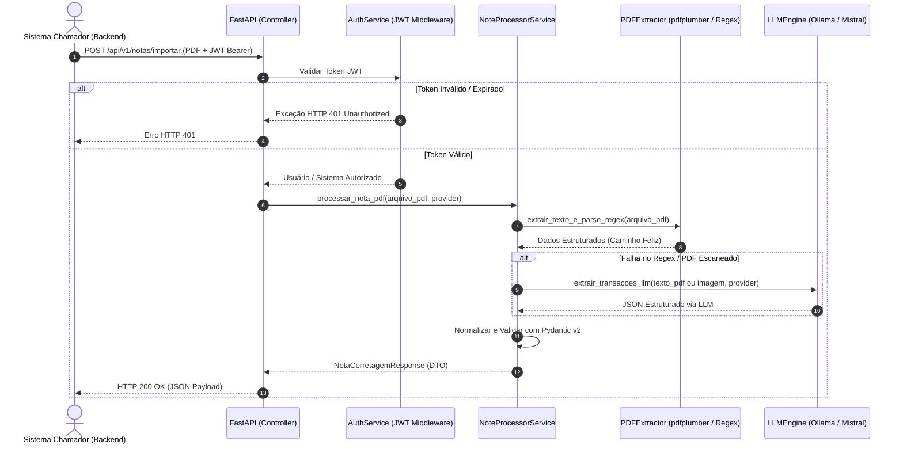
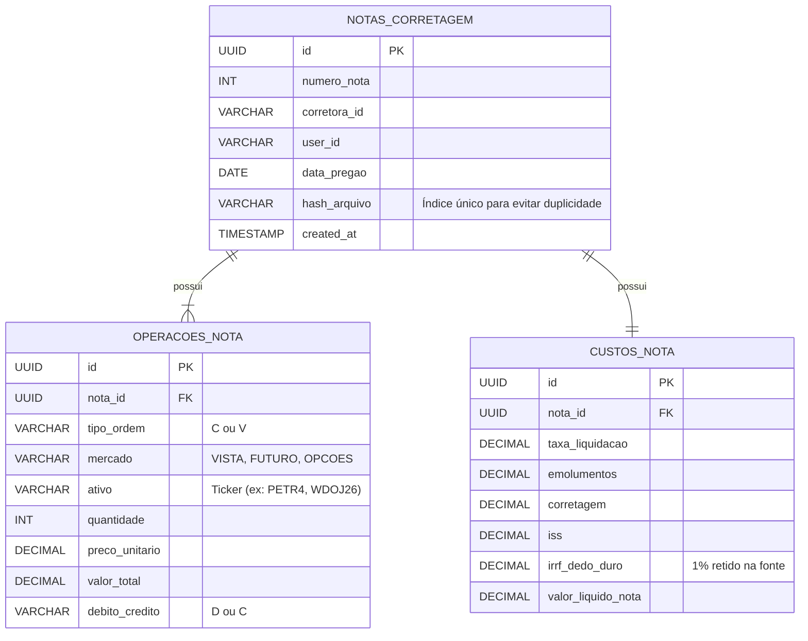

# System Specification Document (SSD) - API de Importação de Notas de Corretagem

## 1. Visão Geral da Arquitetura

O microsserviço **Nota Corretagem API** segue uma arquitetura limpa e modular em Python 3.11+, utilizando o framework **FastAPI** para exposição de endpoints REST de alta performance e **Pydantic v2** para validação estrita de contratos de dados.

O design do sistema prioriza a separação de conceitos (SoC - Separation of Concerns), isolando completamente a camada de transporte HTTP (rotas e controllers) da camada de regras de negócio e extração de PDF (services e extractors). Essa abordagem garante que o sistema opere inicialmente no modelo síncrono (Request $\rightarrow$ Response), mas esteja estruturalmente pronto para ser acoplado a mensagerias assíncronas (como Celery ou ARQ) sem modificação no código de negócio.

---

## 2. Diagrama de Arquitetura e Fluxo de Execução

O fluxo de processamento de uma nota de corretagem ocorre conforme o diagrama de sequência abaixo:



---

## 3. Estrutura de Diretórios do Projeto

A organização interna do repositório segue o padrão modular para microsserviços escaláveis em FastAPI:

```plaintext
nota-corretagem-api/
├── Dockerfile                  # Manifesto de construção da imagem Docker (Multi-stage)
├── docker-compose.yml          # Orquestração de containers para Dev e Prod
├── requirements.txt            # Dependências de produção do projeto
├── README.md                   # Documentação de instalação e uso
├── prd.md                      # Product Requirements Document
├── ssd.md                      # System Specification Document (Este arquivo)
├── .env.example                # Template de variáveis de ambiente
├── docs/
│   └── PLAN-nota-corretagem-api.md # Plano de execução detalhado
└── src/
    ├── __init__.py
    ├── main.py                 # Ponto de entrada da aplicação FastAPI
    ├── core/
    │   ├── __init__.py
    │   ├── config.py           # Gestão de configurações e variáveis de ambiente (Pydantic Settings)
    │   └── security.py         # Middlewares e utilitários de validação JWT
    ├── api/
    │   ├── __init__.py
    │   ├── v1/
    │   │   ├── __init__.py
    │   │   └── endpoints/
    │   │       ├── __init__.py
    │   │       └── notas.py    # Rotas HTTP REST para importação de notas
    ├── schemas/
    │   ├── __init__.py
    │   └── nota.py             # Schemas Pydantic v2 (Input, Output, DTOs de Nota e Operações)
    ├── services/
    │   ├── __init__.py
    │   ├── processor.py        # Serviço orquestrador de extração e validação de notas
    │   ├── extractors.py       # Lógica de extração via pdfplumber e expressões regulares (Regex)
    │   └── llm_engine.py       # Cliente de integração com Ollama (Local) e Mistral API (Nuvem)
    └── utils/
        ├── __init__.py
        └── financial.py        # Utilitários de conversão financeira e cálculos de ajuste BM&F
```

---

## 4. Especificação da API REST (Contrato de Dados)

### Endpoint: Importar Nota de Corretagem

- **Rota:** `POST /api/v1/notas/importar`
- **Autenticação:** Obrigatória (`Bearer Token` JWT no header `Authorization`).
- **Content-Type:** `multipart/form-data`

#### Parâmetros da Requisição (Form Data)

| Campo | Tipo | Obrigatório | Descrição |
| :--- | :--- | :---: | :--- |
| `file` | `UploadFile` | Sim | Arquivo PDF da nota de corretagem (padrão SINACOR). |
| `provider` | `str` | Não | Provedor de IA para fallback (`ollama` ou `mistral`). Default: `ollama`. |
| `model_name` | `str` | Não | Nome do modelo a ser utilizado (ex: `mistral`, `mistral-tiny`). |

#### Exemplo de Payload de Resposta (HTTP 200 OK)

```json
{
  "sucesso": true,
  "ambiente": "producao",
  "dados": {
    "cabecalho": {
      "numero_nota": 123456,
      "data_pregao": "2026-05-16",
      "cpf_cliente": "111.222.333-44",
      "corretora_nome": "XP INVESTIMENTOS CCTVM S/A"
    },
    "operacoes": [
      {
        "tipo_operacao": "C",
        "mercado": "VISTA",
        "ativo": "PETR4",
        "quantidade": 500,
        "preco_unitario": 38.50,
        "valor_total": 19250.00,
        "debito_credito": "D"
      },
      {
        "tipo_operacao": "V",
        "mercado": "VISTA",
        "ativo": "PETR4",
        "quantidade": 500,
        "preco_unitario": 39.00,
        "valor_total": 19500.00,
        "debito_credito": "C"
      },
      {
        "tipo_operacao": "C",
        "mercado": "FUTURO",
        "ativo": "WDOJ26",
        "quantidade": 5,
        "preco_unitario": 5200.00,
        "valor_total": 500.00,
        "debito_credito": "C"
      }
    ],
    "resumo_financeiro": {
      "taxa_liquidacao": 5.20,
      "emolumentos": 3.80,
      "taxa_corretagem": 0.00,
      "iss": 0.00,
      "irrf_dedo_duro": 2.50,
      "valor_liquido_nota": 238.50
    }
  }
}
```

#### Tratamento de Erros (HTTP Status Codes)

- **400 Bad Request:** Arquivo enviado não é um PDF ou o PDF está corrompido/vazio.
- **401 Unauthorized:** Token JWT ausente, inválido ou expirado.
- **422 Unprocessable Entity:** Erro de validação de parâmetros (schema Pydantic inválido).
- **500 Internal Server Error:** Falha inesperada no processamento de extração ou no motor de IA.

---

## 5. Modelagem de Dados Sugerida para o Banco Cliente

Para garantir a preservação do histórico fiscal e a capacidade de reprocessamento, o sistema chamador (cliente) deve adotar uma estrutura normalizada no seu banco de dados relacional (PostgreSQL/MySQL), conforme sugerido abaixo:



---

## 6. Estratégia de Conteinerização e DevOps

O projeto adota Docker para garantir paridade entre os ambientes de desenvolvimento e produção, seguindo as melhores práticas de segurança e otimização de imagem.

### Dockerfile Multi-stage
O manifesto Docker utiliza um build multi-stage baseado na imagem oficial `python:3.11-slim`. A primeira etapa compila as dependências do sistema (como drivers para compilação de pacotes C e ferramentas de PDF), enquanto a imagem final contém apenas os artefatos compilados e o código da aplicação, reduzindo drasticamente a superfície de ataque e o tamanho do container.

### Docker Compose
O orquestrador `docker-compose.yml` expõe a aplicação na porta `8000` e gerencia as variáveis de ambiente essenciais. No ambiente de produção, a aplicação é executada via Uvicorn/Gunicorn com múltiplos workers para maximizar o throughput de requisições concorrentes.

---

## 7. Segurança e Gestão de Segredos

### Blindagem do `.env`
O sistema utiliza `pydantic-settings` para carregar e validar as variáveis de ambiente na inicialização da aplicação. O arquivo `.env` deve conter as seguintes chaves essenciais:

```bash
# Configurações da Aplicação
ENVIRONMENT=development
PORT=8000
LOG_LEVEL=info

# Segurança JWT
JWT_SECRET_KEY=sua_chave_secreta_jwt_super_segura_aqui
JWT_ALGORITHM=HS256

# Configurações de IA (Fallback)
OLLAMA_BASE_URL=http://host.docker.internal:11434
MISTRAL_API_KEY=sua_api_key_da_mistral_aqui
```

### Isolamento de Rede
No Docker Compose de produção, a API opera em uma rede interna isolada (`backend-network`), acessível apenas pelo API Gateway ou pelo microsserviço chamador, impedindo acesso público direto às portas não autorizadas.
